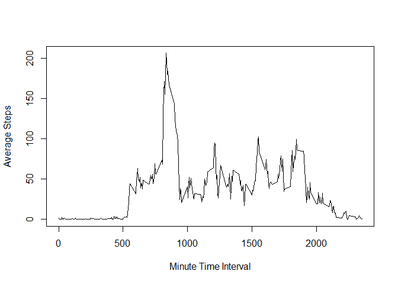
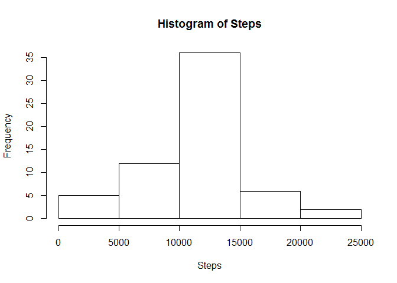

# Reproducible Research: Peer Assessment 1
echo = true

##Loading and preprocessing the data

1. Load the data (i.e. read.csv())
2. Process/transform the data (if necessary) into a format suitable for your analysis

Read file into environment


```r
data <- read.csv(unzip('activity.zip'))
```

Create dataframe of total steps each day


```r
daily <- data.frame(rowsum(data$steps, data$date))
names(daily) <- c('steps')
```


##What is mean total number of steps taken per day?

1. Make a histogram of the total number of steps taken each day 
2. Calculate and report the mean and median total number of steps taken per day


Produce histogram of dataframe for each day activity.

```r
hist(daily$steps, main = "Histogram of Steps", xlab = "Steps")
```


Calculate daily mean steps

```r
mean(daily$steps, na.rm = TRUE)
```

```
## [1] 10766.19
```

Calculate daily median steps

```r
median(daily$steps, na.rm = TRUE)
```

```
## [1] 10765
```


##What is the average daily activity pattern?
1. Make a time series plot (i.e. type = "l") of the 5-minute interval (x-axis) and the average number of steps taken, averaged across all days (y-axis)
2. Which 5-minute interval, on average across all the days in the dataset, contains the maximum number of steps?


**Aggregate average internal steps in a DataFrame**


```r
interval.mean <- aggregate(data$steps, list(data$interval), mean, na.rm = TRUE)
names(interval.mean) <- c('interval', 'mean.steps')
```


**Plot average steps per interval across all days**


```r
plot(x=interval.mean$interval, y=interval.mean$mean.steps, type = 'l', 
     xlab = "Minute Time Interval", ylab = "Average Steps")
```




**Find the maximum average interval**


```r
interval.mean[which.max(interval.mean$mean.steps),]
```

```
##     interval mean.steps
## 104      835   206.1698
```

##Imputing missing values
1. Calculate and report the total number of missing values in the dataset (i.e. the total number of rows with NAs) 
2. Devise a strategy for filling in all of the missing values in the dataset. The strategy does not need to be sophisticated. For example, you could use the mean/median for that day, or the mean for that 5-minute interval, etc. 
3. Create a new dataset that is equal to the original dataset but with the missing data filled in. 
4. Make a histogram of the total number of steps taken each day and Calculate and report the mean and median total number of steps taken per day. Do these values differ from the estimates from the first part of the assignment? What is the impact of imputing missing data on the estimates of the total daily number of steps

**Calculate the number of NA records**


```r
sum(is.na(data$steps))
```

```
## [1] 2304
```

**Strategy for filling in missing values**
Using Interval Mean to fill in missing data.

**Create dataset that with imputed numbers for missing data.**

```r
imputted.data <- data 
for (i in 1:nrow(imputted.data)) {
    if (is.na(imputted.data$steps[i])) {
        imputted.data$steps[i] <- interval.mean[which(imputted.data$interval[i] == interval.mean$interval), ]$mean.steps
    }
}

imputted.daily <- data.frame(rowsum(imputted.data$steps, imputted.data$date))
names(imputted.daily) <- c('steps')
```

Produce histogram of imputted dataframe for each day activity.

```r
hist(imputted.daily$steps, main = "Histogram of Steps", xlab = "Steps")
```



Calculate imputted daily mean steps

```r
mean(imputted.daily$steps)
```

```
## [1] 10766.19
```

Calculate imputted daily median steps

```r
median(imputted.daily$steps)
```

```
## [1] 10766.19
```

Difference between Mean with imputted values for missing data and excluding missing data in the orignal calculation.


```r
mean(daily$steps, na.rm = TRUE) - 
     mean(imputted.daily$steps)
```

```
## [1] 0
```

Difference between median with imputted values for missing data and excluding missing data in the orignal calculation.


```r
median(daily$steps, na.rm = TRUE) - 
     median(imputted.daily$steps)
```

```
## [1] -1.188679
```


##Are there differences in activity patterns between weekdays and weekends?

1. Create a new factor variable in the dataset with two levels - "weekday" and "weekend" indicating whether a given date is a weekday or weekend day. 
2. Make a panel plot containing a time series plot (i.e. type = "l") of the 5-minute interval (x-axis) and the average number of steps taken, averaged across all weekday days or weekend days (y-axis). The plot should look something like the following, which was creating using simulated data:

**Add new variable "weekday" based on weekend or weekday from date.**

```r
imputted.data$date <- as.Date(imputted.data$date, "%Y-%m-%d")
imputted.data$weekday <- weekdays(imputted.data$date, abbreviate=TRUE)

library(stringr)

imputted.data$weekday <- str_replace_all(imputted.data$weekday, "Mon","weekday")
imputted.data$weekday <- str_replace_all(imputted.data$weekday, "Tue","weekday")
imputted.data$weekday <- str_replace_all(imputted.data$weekday, "Wed","weekday")
imputted.data$weekday <- str_replace_all(imputted.data$weekday, "Thu","weekday")
imputted.data$weekday <- str_replace_all(imputted.data$weekday, "Fri","weekday")
imputted.data$weekday <- str_replace_all(imputted.data$weekday, "Sat","weekend")
imputted.data$weekday <- str_replace_all(imputted.data$weekday, "Sun","weekend")

head(imputted.data)
```

```
##       steps       date interval weekday
## 1 1.7169811 2012-10-01        0 weekday
## 2 0.3396226 2012-10-01        5 weekday
## 3 0.1320755 2012-10-01       10 weekday
## 4 0.1509434 2012-10-01       15 weekday
## 5 0.0754717 2012-10-01       20 weekday
## 6 2.0943396 2012-10-01       25 weekday
```


**Plot Time Series of average number of steps taken.**

```r
mean.Steps <- aggregate(imputted.data$steps, 
                      list(interval = as.numeric(as.character(imputted.data$interval)), 
                           weekdays = imputted.data$weekday),
                      FUN = "mean")
names(mean.Steps)[3] <- "meanOfSteps"
library(lattice)
xyplot(mean.Steps$meanOfSteps ~ mean.Steps$interval | mean.Steps$weekdays, 
       layout = c(1, 2), type = "l", 
       xlab = "Interval", ylab = "Number of steps")
```


